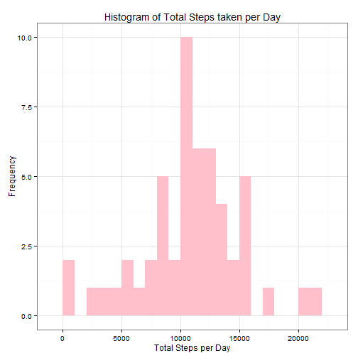
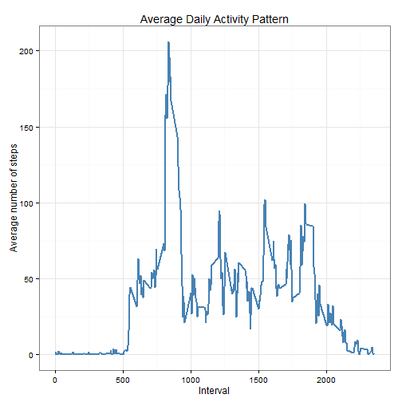
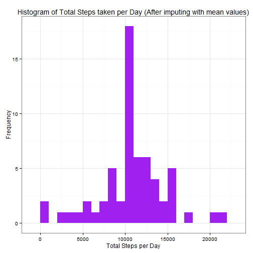
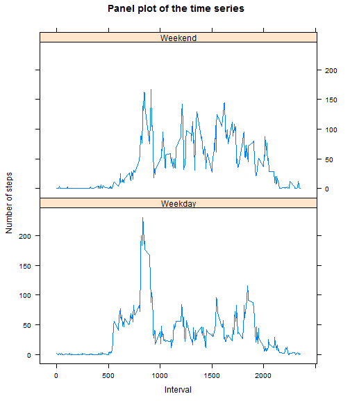

### Introduction

This assignment makes use of data from a personal activity monitoring device. This
device collects data at 5 minute intervals through out the day. The data consists 
of two months of data from an anonymous individual collected during the months of
October and November, 2012 and include the number of steps taken in 5 minute intervals each day.

This document presents the results of the analyses. A markdown document with the code,
related-text and results that is converted into this html page using R's knitr package.


#### Load packages

Load necessary packages and Set system options to show code and results in the 
output. Various packages have been used in an attempt to practice variety.

```r
library(knitr)
library(dplyr)
library(ggplot2)
library(lattice)
```


#### Read the activity dataset with the columns as numeric & character.

```r
opts_chunk$set(echo=TRUE, results="hold")
df <- read.csv("activity.csv", 
        na.strings="NA", 
        colClasses=c("numeric", "character", "numeric"))
```
#### Process/transform the data into a format suitable for the analyses.
The date column is changed to date class and interval to factor.
Also displayed is the summary of the dataset.

```r
df$date <- as.Date(df$date, format = "%Y-%m-%d")
dft<-df
df$interval <- as.factor(df$interval)
summary(df)
str(df)
```

```
##      steps             date               interval    
##  Min.   :  0.00   Min.   :2012-10-01   0      :   61  
##  1st Qu.:  0.00   1st Qu.:2012-10-16   5      :   61  
##  Median :  0.00   Median :2012-10-31   10     :   61  
##  Mean   : 37.38   Mean   :2012-10-31   15     :   61  
##  3rd Qu.: 12.00   3rd Qu.:2012-11-15   20     :   61  
##  Max.   :806.00   Max.   :2012-11-30   25     :   61  
##  NA's   :2304                          (Other):17202  
## 'data.frame':	17568 obs. of  3 variables:
##  $ steps   : num  NA NA NA NA NA NA NA NA NA NA ...
##  $ date    : Date, format: "2012-10-01" "2012-10-01" ...
##  $ interval: Factor w/ 288 levels "0","5","10","15",..: 1 2 3 4 5 6 7 8 9 10 ...
```

#### Mean total number of steps taken per day

* Ignoring the missing values in the dataset, calculate the total number of steps
taken per day. Also included is the glimpse of the output data.

```r
total_steps <- aggregate(steps ~ date, df, sum)
head(total_steps)
```

```
##         date steps
## 1 2012-10-02   126
## 2 2012-10-03 11352
## 3 2012-10-04 12116
## 4 2012-10-05 13294
## 5 2012-10-06 15420
## 6 2012-10-07 11015
```

* This histogram gives a pictorial representation of the total number of steps 
taken each day

```r
ggplot(total_steps, aes(x = steps)) + 
       geom_histogram(fill = "pink", binwidth = 1000) +
       labs(title="Histogram of Total Steps taken per Day", 
                x = "Total Steps per Day",
                y = "Frequency") +
       theme_bw() 
```

 

* The mean and median of the total number of steps taken per day are:

```r
MeanOfSteps   <- mean(total_steps$steps, na.rm=TRUE)
paste("Mean of total number of steps taken per day = ", MeanOfSteps)
MedianOfSteps <- median(total_steps$steps, na.rm=TRUE)
paste("Median of total number of steps taken per day = ", MedianOfSteps)
```

```
## [1] "Mean of total number of steps taken per day =  10766.1886792453"
## [1] "Median of total number of steps taken per day =  10765"
```
#### Average daily activity pattern

* A time series plot of the 5-minute interval (x-axis) and the average number of
  steps taken, averaged across all days (y-axis).
  

```r
# Find average number of steps on all days grouped by the 5-minute interval
mean_steps <- df %>% group_by(interval) %>% summarize(Mean=mean(steps, na.rm=TRUE))

# Plot the time series plot; have to convert the x variable, interval into 
#  integer in order to plot
ggplot(mean_steps, aes(x=as.integer(levels(interval)), y=Mean)) +   
       geom_line(color="steelblue", size=1) +  
       labs(title="Average Daily Activity Pattern",
            x="Interval",
            y="Average number of steps") +  
       theme_bw()
```

 

* Which 5-minute interval, on average across all the days in the dataset, 
  contains the maximum number of steps?

```r
# what is the maximum number of steps
paste("Maximum = ", max(mean_steps$Mean))
# which 5-minute interval corresponds to this maximum number of steps
paste("5-minute interval corresponding to the maximum number of steps = ",
       mean_steps[which.max(mean_steps$Mean),]$interval)
```

```
## [1] "Maximum =  206.169811320755"
## [1] "5-minute interval corresponding to the maximum number of steps =  835"
```
The **835^th^** interval has maximum 206 steps.


===========================================================================================

## Imputing missing values

There are a number of days/intervals where there are missing values. The presence
of missing days may introduce bias into some calculations or summaries of the data.

* The total number of missing values in the dataset   

```r
paste("Total number of missing values in the dataset is", sum(is.na(dft$steps)))
```

```
## [1] "Total number of missing values in the dataset is 2304"
```

* The strategy for filling in all of the missing values in the dataset is using 
  the  mean for that 5-minute interval. For instance, if there is a missing steps 
  value for the 250th interval, impute it with the mean steps of 250th interval.


```r
df_new <- data.frame()    # Create an empty dataframe
StepsFilled <- numeric()  # Create an empty numeric vector

# For each row in the original dataframe, check if that row has NA and then 
# replace with the corresponding steps value from mean_steps dataset
for (i in 1:nrow(dft)) {
        obs <- dft[i, ]
        if (is.na(obs$steps)) {
                steps <- mean_steps[mean_steps$interval==obs$interval,]$Mean
        } else {
                steps <- obs$steps
        }
        StepsFilled<- c(StepsFilled, steps)
        
}
```

* Create a new dataset that is equal to the original dataset but with the missing
  data filled in.


```r
df_new <- cbind(dft, StepsFilled)  ## column bind the stepsfilled vector to the new dataframe
df_imputed <- df_new[, 2:4]       ## Remove the columns with steps as NAs
names(df_imputed) <- c("date", "interval", "steps")
```


* Histogram of the total number of steps taken each day 

```r
total_steps_imputed <- aggregate(steps ~ date, df_imputed, sum)


## Make a histogram of the total number of steps taken each day

ggplot(total_steps_imputed, aes(x = steps)) + 
        geom_histogram(fill = "purple", binwidth = 1000) +
        labs(title="Histogram of Total Steps taken per Day (After imputing with mean values)", 
             x = "Total Steps per Day",
             y = "Frequency") +
        theme_bw() 
```

 

* The mean and median total number of steps taken per day.

```r
MeanOfSteps   <- mean(total_steps_imputed$steps, na.rm=TRUE)
paste("Mean of total number of steps taken per day = ", MeanOfSteps)
MedianOfSteps <- median(total_steps_imputed$steps, na.rm=TRUE)
paste("Median of total number of steps taken per day = ", MedianOfSteps)
```

```
## [1] "Mean of total number of steps taken per day =  10766.1886792453"
## [1] "Median of total number of steps taken per day =  10766.1886792453"
```

 * Rounded values of mean and median from before and after the imputation are as 
 follows:

- **With missing values **
  *      Mean =  10766.19
  *      Median = 10765 
  
- **After imputation **
  *      Mean =  10766.19
  *     Median = 10766.19
  
 After imputation with the mean of the corresponding intervals, the mean & median
 are equal.
 
 =====================================================================================
 
### Are there differences in activity patterns between weekdays and weekends?

*   Using the dataset with the filled-in missing values, a new factor variable is
created denoting the day of the week corresponding to the date. The new factor 
variable called 'day' can have two levels Weekday or Weekend.


```r
df_imputed["day"] <- ""
for (i in 1:nrow(df_imputed))
{       if (weekdays(df_imputed[i,]$date) == "Saturday") 
        { df_imputed[i,]$day <- "Weekend"} 
        
        else if (weekdays(df_imputed[i,]$date) == "Sunday") 
        {df_imputed[i,]$day <- "Weekend"}
        
        else {df_imputed[i,]$day <- "Weekday"}
}
df_imputed$day <- as.factor(df_imputed$day)
```

* This panel plot containing a time series plot shows the 5-mininterval (x-axis)
and the average number of steps taken, averaged across all weekday days or 
weekend days (y-axis). 

```r
mean_steps_imputed <- df_imputed %>% group_by(interval, day) %>% summarize(Mean=mean(steps))

xyplot(Mean ~ interval | day, mean_steps_imputed,
        type = "l",
        layout = c(1, 2), 
        xlab = "Interval", 
        ylab = "Number of steps",
        main = " Panel plot of the time series")
```

 

The panel plot provides an easy way to spot the patterns of average number of steps per interval over the 
weekend vs over the weekdays.

=========================================================================================================


 


